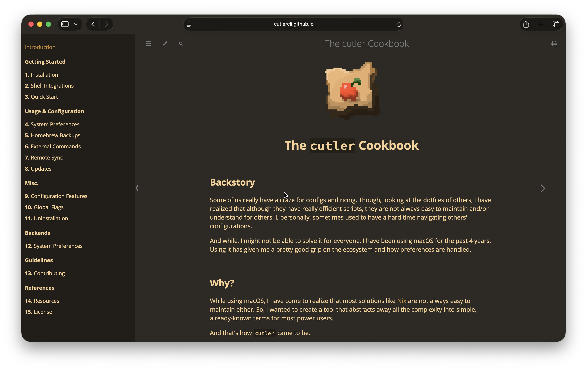
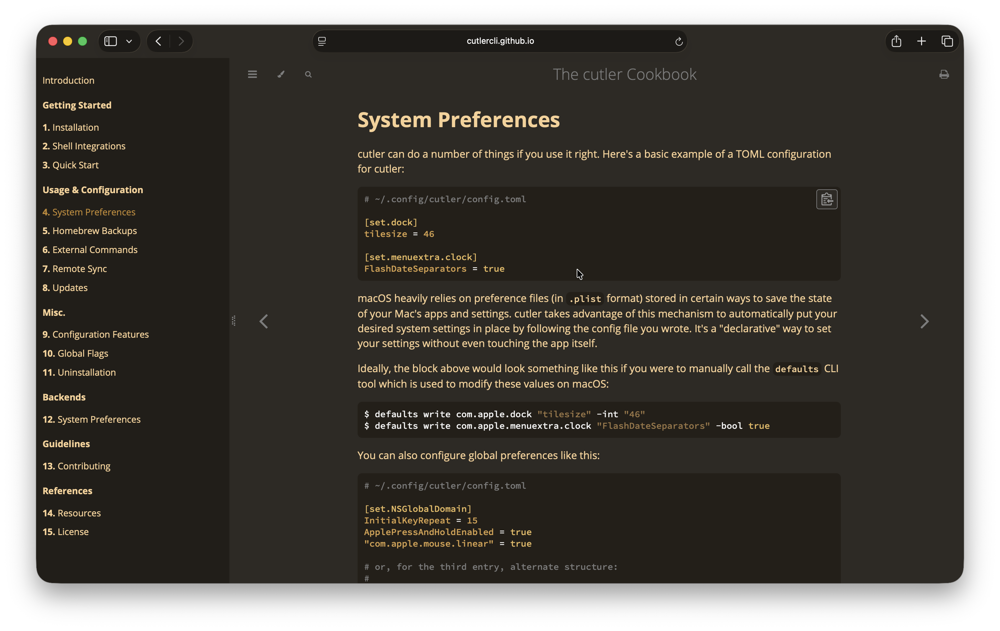

<div align="center">

# mdbook-brew

A Homebrew-inspired mdBook theme

</div>

## Overview

mdbook-brew is a theme for the [mdBook](https://rust-lang.github.io/mdBook/) utility. It replicates the cozy, caffeinated-like atmosphere found in [Homebrew's website](https://brew.sh/).

## Requirements

- [mdBook](https://rust-lang.github.io/mdBook/) should be installed, and you're good.

## Installation

1. Create a new mdBook project with the `--theme` flag:

   ```bash
   $ mdbook init --theme
   ```

2. Navigate to the directory and in the **theme/** folder, delete everything except **index.hbs**.

3. Clone this repository:

   ```bash
   $ git clone https://github.com/hitblast/mdbook-brew.git
   ```

4. Copy **src/mdbook-brew.css** from the cloned repo and paste it in the **theme/** folder.

5. In your **book.toml** file, add the following line under the `[output.html]` section:

   ```toml
   [output.html]
   theme = "mdbook-brew"
   additional_css = ["./theme/mdbook-brew.css"]
   ```

6. Edit the **index.hbs** file and modify the theme navigation menu's contents:

   ```diff
   - <li role="none"><button role="menuitem" class="theme" id="light">Light</button></li>
   - <li role="none"><button role="menuitem" class="theme" id="rust">Rust</button></li>
   - <li role="none"><button role="menuitem" class="theme" id="coal">Coal</button></li>
   - <li role="none"><button role="menuitem" class="theme" id="navy">Navy</button></li>
   - <li role="none"><button role="menuitem" class="theme" id="ayu">Ayu</button></li>
   + <li role="none"><button role="menuitem" class="theme" id="mdbook-brew">mdbook-brew</button></li>
   ```

7. Run `mdbook serve` to preview your book locally.

8. Enjoy!

## Screenshots




## License

This project is licensed under the [MIT](LICENSE) license.
